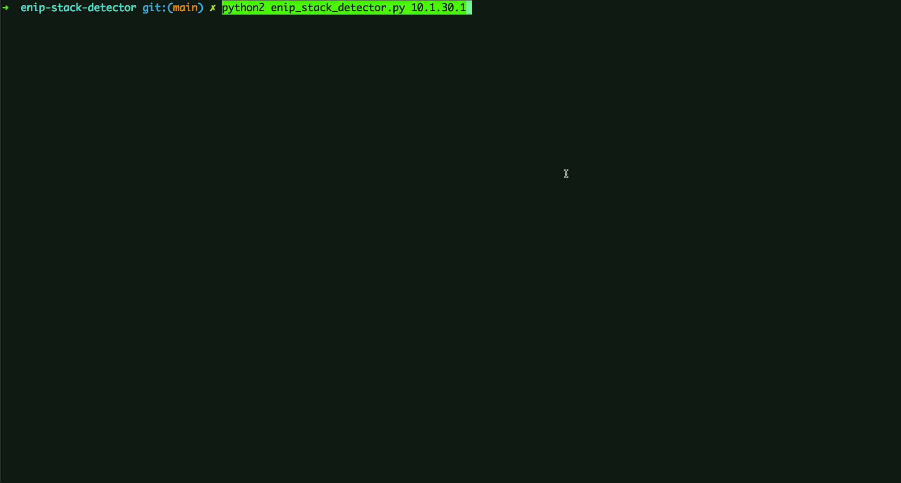

# EtherNet/IP & CIP Stack Detector
EtherNet/IP & CIP Stack Detector that can help both cyber-security researchers, OT engineers, and asset owners to identify devices that are running a specific EtherNet/IP protocol stack.




### How to use the tool
```
python2 enip_stack_detector.py IP_ADDR
```
Note: please use python2 with `construct==2.9.45`. To quickly install `construct==2.9.45` please use:
`pip2 -m install construct==2.9.45 --user`

### Currently supported EtherNet/IP protocol stacks
* RTAutomation EtherNet/IP Stack
* CPPPO (e.g. conpot) EtherNet/IP Stack
* OpENer Stack EtherNet/IP Stack
* Rockwell 1756-EN2TR/A EtherNet/IP Stack
* Rockwell 1756-L81E/B EtherNet/IP Stack
* Rockwell RSLinx EtherNet/IP Stack
* Rockwell LC 20/50 EtherNet/IP Stack
* Rockwell 1763/1766 EtherNet/IP Stack
* Rockwell 1769 EtherNet/IP Stack
* Rockwell SoftLogix5800 Emulator EtherNet/IP Stack
* Rockwell PanelView Plus EtherNet/IP Stack
* Rockwell SLC/PLC5 EtherNet/IP Stack

### How can the tool be used
This can be used both for security research and as part of an internal investigation to quickly scan many devices to retrieve their EtherNet/IP protocol stack. More reasons to use the tool:
* Vulnerability research
* Honeypot detection (for example [conpot](https://github.com/mushorg/conpot) which uses [CPPPO](https://github.com/pjkundert/cpppo) behind the scenes, and [can  easily get detected](https://www.shodan.io/search?query=Serial+number%3A+0x006c061a))
* Scan which devices are affected by some vulnerability in one of the EtherNet/IP protocol stacks* 

### How the tool works
This tool performs behavioral profiling by breaking down the EtherNet/IP and CIP protocols to specific properties and attributes, which later creates a unique signature for the ENIP stack in use based on all the collected parameters. Supersetting all the unique implementation hints gives the true identity of the ENIP stack being used. A parameter can be any delicate attribute of the protocol and the implementation, for example, an attribute that determines whether a certain feature of the ENIP protocol is currently supported. Scanning two different devices that use the same core ENIP stack (e.g. an SDK purchased from the same vendor) will result with the same unique signature. 

### How Claroty uses this tool
This tool enables Claroty researchers to identify various classes of ENIP stacks and group similar implementations of different ENIP stacks. For example, Claroty researchers identified the unique signature generated by devices running [RTA’s ENIP stack](https://www.claroty.com/2020/11/17/blog-research-rta-enip-stack-vulnerability/). With that, they started to scan many ENIP-compatible devices in order to detect all potentially affected devices. Eventually, through this tool, Claroty researchers were able to scan 290 ***unique*** ENIP-compatible devices, which reveled 32 unique ENIP stacks. 

Eventually, out of the 290 unique devices scaned, eleven devices were found to be running RTA’s ENIP stack in products from six unique vendors and appropriate actions were taken accordingly (disclosure process).

### Output Example
```bash
 ==============Device================
 [!] 192.168.1.200: 1756-ENBT/A (vendor:1 type: 12, v6.4)
 ====================================

==============Tests===============
[ X ]: ENIP Register Session Number Sequential (Used value: 0x1)
[ X ]: ENIP Register Session Number Sequential (Used value: 0x10)
[ V ]: ENIP Register Session Number Sequential (Used value: 0x100)
[ X ]: ENIP Register Session Number Sequential (Used value: 0x1000)
[ X ]: ENIP Register Session Number Sequential (Used value: 0x10000)
[ X ]: ENIP Can Register Session with Bad Options (Used value: 1)
[ X ]: ENIP Can Register Session with Bad Length (Used value: 3)
[ V ]: ENIP Is List Targets Supported
[ V ]: ENIP List Services Protocol Version is 1
[ X ]: ENIP List Services Name is "Communications \x00" (with space)
[ X ]: ENIP List Services Name is "Communications\x00" (with single null (bug))
[ V ]: ENIP List Services Name is "Communications\x00\x00" (with nulls)
[ X ]: ENIP List Services Name is "COMMUNICATIONS\x00\x00" (upper with nulls)
[ V ]: ENIP List Services Name Capability Flags Reserved Bit Are Empty
[ V ]: CIP Forward Open is supported
[ V ]: CIP Forward Open allows multiple requests for connection id 0
[ X ]: CIP Forward Open is O2T Sequential by 1
[ V ]: CIP Forward Open is T2O zero
[ V ]: CIP Forward Open can open with bad connection flags
====================================

==============Results===============
[!] EtherNet/IP & CIP Stack: 1756-EN2TR/A (sig: '0010000110010111011')
====================================
```

### Supported attributes
Based on our research, we are collecting the following boolean flags during a scan:
* ENIP Register Session Number Sequential (0x1, 0x10, 0x100, 0x1000, 0x10000)
* ENIP Can Register Session with Bad Options (Used value: 1)
* ENIP Can Register Session with Bad Length (Used value: 3)
* ENIP Is List Targets Supported
* ENIP List Services Protocol Version is 1
* ENIP List Services Name ('Communications' variation)
* ENIP List Services Name Capability Flags Reserved Bit Are Empty
* CIP Forward Open is supported
* CIP Forward Open allows multiple requests for connection id 0
* CIP Forward Open is O2T Sequential by 1
* CIP Forward Open is T2O zero
* CIP Forward Open can open with bad connection flags

# More Resources
- [RTA ENIP Stack Vulnerability Poses Risk to ICS Devices](https://www.claroty.com/2020/11/17/blog-research-rta-enip-stack-vulnerability/)
- [Fuzzing and PR’ing: How We Found Bugs in a Popular Third-Party EtherNet/IP Protocol Stack](https://claroty.com/2021/04/15/blog-research-fuzzing-and-pring/)
